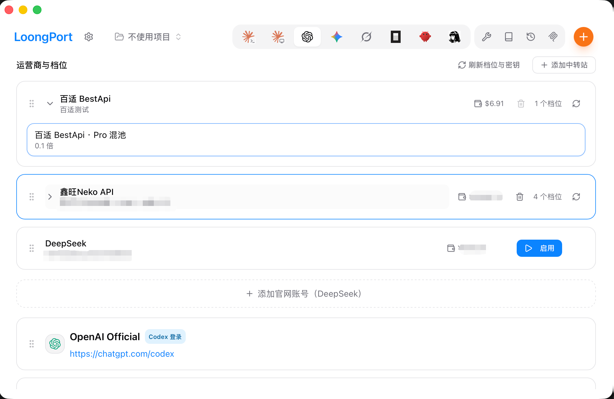

<div align="center">


# LoongPort

### Codex at 5% of official cost, Claude at 20%, no extra network setup

[](../../releases/latest)

[](../../releases)
[](https://tauri.app/)
[](LICENSE)

### 🌐 Official website: **[loongport.dev](https://loongport.dev)**

[中文](README.md) | English

</div>

## What it does

You want to run Codex CLI or Claude Code without paying official API rates. Normally
that means: sign up with a relay provider, hunt for their console, create an API key by
hand, copy the `base_url` correctly, track down the config file, and get every field
exactly right. Then do it all again for another CLI or tier.

LoongPort collapses that into two steps — **enter a domain, sign in once.** It
provisions a key for every tier your account can reach, writes each CLI's config in
its own shape, and switching tiers becomes a single click.

If your site has an image tier, you can also
[**generate images right inside your CLI**](#generating-images-in-your-cli) — without
giving up the tier you chat on.

<div align="center">
  
  <br>
  <sub>Chinese UI shown; the app also ships English, Traditional Chinese and Japanese.</sub>
</div>

## Why it costs so much less

Two discount layers — Codex gets both, Claude gets one:

| Factor | | Who gets it | Why |
|---|---|---|---|
| Tier multiplier | **×0.1** | Codex only | Most GPT tiers bill at a 0.1 multiplier — a tenth of the official rate for the same token usage. Anthropic tiers carry no such discount and bill at 1 |
| Currency convention | **×1/6.7** | Codex and Claude alike | Relay sites generally price 1 CNY as if it were 1 USD, while the actual rate is roughly 6.7 CNY to the dollar |

So Codex lands at `0.1 × 1/6.7 ≈ 0.015` — about **1.5% of the official API cost** — and
Claude at `1 × 1/6.7 ≈ 0.15`, about **15% of official cost**. The headline says "5%" and
"20%" because multipliers vary by tier and by site, so there is margin built in. Full
derivation with caveats:
**[loongport.dev/en/pricing](https://loongport.dev/en/pricing)**

LoongPort is free. It never handles your payment and takes nothing out of your balance.
You top up with the relay provider.

> Registration links carry our referral code, which may earn us a rebate from the relay
> site; `bestapi.store` is our own site, and the built-in `LOONGPORT` promo code is a
> new-user credit there. Neither affects your price, and you can use any domain. Both
> tables live in `src-tauri/src/operator/` — `aff.rs` and `promo.rs`.

## Your official accounts stay untouched

Both official logins stay where they are — switch back any time without editing anything
by hand. The mechanism differs between the two:

- **Codex**: the ChatGPT desktop app and the `codex` CLI **share one** credentials file
  (`~/.codex/auth.json`), so it has to be preserved explicitly — LoongPort does that by
  default and never writes to it when switching tiers.
- **Claude**: the official login lives in `~/.claude/.credentials.json` while tier
  switches write `settings.json` next to it — **two separate files**, so there is nothing
  to overwrite.

## Install

| Platform | Requirement |
|---|---|
| **Windows** | Windows 10 or later |
| **macOS** | macOS 12 (Monterey) or later |

Download from the [Releases](../../releases) page. Every release is built automatically
by GitHub Actions, for both Windows and macOS:

| Platform | File | Notes |
|---|---|---|
| **Windows** | `LoongPort-v{version}-Windows-Portable.zip` | **Portable, recommended** — unzip to get a single `LoongPort.exe` and run it; no Windows Installer involved |
| | `LoongPort-v{version}-Windows.msi` | Installer (adds a Start menu entry) |
| **macOS** | `LoongPort-v{version}-macOS.dmg` | — |

On ARM64 Windows machines (Snapdragon laptops and the like), use the two files with
`-arm64` in the name — again one installer and one portable build.

> **On Windows, prefer the portable build.** It unzips to a single exe (the WebView2 loader is
> statically linked, so no extra DLLs are needed next to it) — put it anywhere and
> double-click. Security software sometimes blocks the Windows Installer from
> **backing up old files** (reported as `could not set file security for file
> '...\Config.Msi\xxxxxxx.rbf'  Error: 5`); the portable build has no install step, so
> there is nothing to block.
>
> It does need the WebView2 runtime, which Windows 10 and later generally ship with.

> **macOS blocks the first launch.** The macOS build is not code-signed or notarized by
> Apple, so Gatekeeper reports the app as "damaged" — it is not. Run this once in
> Terminal; **once is enough**:
>
> ```bash
> xattr -dr com.apple.quarantine /Applications/LoongPort.app
> ```
>
> Signing and notarization need an Apple Developer account ($99/year) and will come in a
> later release — it only affects this one installation step, and once installed the app
> works exactly as it does on Windows.

> **Already on the installer and an upgrade fails with "could not set file security".**
> On a few machines running security software (Tencent PC Manager, for one), installing
> *over* an older version fails with `could not set file security for file
> '...\Config.Msi\xxxxxxx.rbf'  Error: 5` — that is the security software blocking the
> installer from **backing up the old files**, not a broken package. Uninstall the old
> version first (Settings → Apps), then run the new installer: a fresh install has
> nothing to back up, so nothing gets blocked. **Your account and settings are kept** —
> they live in your user folder, untouched by uninstall, so you stay signed in.
>
> First-time installs and the portable build are both unaffected; this only happens when
> overwriting an older version.

## How it works

1. **Enter a domain** — your relay provider's site. Leave it blank to use the default.
2. **Sign in** — the provider's real login page loads in a window; register or sign in
   right there. LoongPort receives the resulting credentials and never sees your password.
3. **Keys provisioned** — one per available tier. Existing keys with matching names are
   reused before new ones get created, so hitting refresh never litters your account.
4. **Pick a CLI and tier** — Codex uses OpenAI tiers, Claude uses Anthropic tiers. One
   click writes the matching config (`~/.codex/config.toml`, or Claude's settings).
5. **Keep working** — Codex or Claude Code just works. **When switching a Codex tier**,
   the ChatGPT desktop app is quit and reopened automatically (it only reads its config
   at startup, so without a restart the new tier has no effect). Claude tier switches do
   not involve it.

Credentials and site data live in a local SQLite database under `~/.loongport/` and are
sent only to the relay site you chose, as the Bearer token on its API calls. LoongPort
has no account system and no server of its own, so it never receives them.

## Generating images in your CLI

Tiers that only serve image models are collected on their own **Codex Images** tab
(next to Codex). Click **Enable** on one of them, and asking for an image in
conversation just works in Codex, Claude Code or Gemini CLI — the generation runs
through LoongPort's built-in image tool (an MCP server).

Four things worth knowing:

- **This tab is not usable on its own** — it works alongside a chat tier. All it
  decides is which tier your images come from.
- **Your chat tier does not step aside.** Chat goes to `/v1/responses` with whichever
  tier you picked on the Codex page; images go to `/v1/images/generations` with
  whichever you picked here — two independent "current" selections, and switching one
  never disturbs the other. So you can chat through DeepSeek while images come from a
  relay's 4K group.
- **Switching image tiers needs no CLI restart.** The choice lives in LoongPort's own
  database and is read fresh on every generation; the CLI's config file is not touched.
  Only the **very first** image tier needs a new terminal (that is when the tool is
  added to the CLI's config, and CLIs only read their config at startup).
- **A site with no image group leaves this tab empty**, and your CLI configs are left
  untouched. Picking between a 1K and a 4K tier is a spending decision, so LoongPort
  never picks for you.

## Updating

**The installer (msi) and the macOS build check for updates on their own**: a few
seconds after launch they ask once in the background, and a newer version shows up
under Settings → About — one click downloads, installs and restarts. A failed check
never bothers you (being offline or unable to reach GitHub is common enough), and you
can press "check for updates" yourself at any time.

> **The Windows portable build does not update in place** — it cannot replace itself
> while running. It still tells you a new version exists, but you download the new zip
> from [Releases](../../releases). That is the trade-off for the portable build: no
> install step, so nothing for security software to block.

## What it supports

| | Shipped | In progress |
|---|---|---|
| **Relay services** | sub2api | new-api |
| **AI CLIs** | codex · claude | gemini · grok |
| **Platforms** | macOS · Windows | Linux |

> **The "AI CLIs" row is about chat tiers.** The image tool registers with codex,
> claude **and gemini** — "gemini in progress" means it cannot yet be the target of a
> chat tier (its config shape is not written yet), not that it is untouched.

You can point it at your own site domain; a working one is preset by default. macOS and
Windows have the same feature set.

> One detail differs, and only when switching a **Codex** tier (that is the step which
> restarts the ChatGPT desktop app for you; Claude switches leave it alone): **on macOS
> it asks the app to quit** — if ChatGPT has a conversation in progress it shows its own
> confirmation dialog and you can cancel (which aborts that switch); **on Windows the
> process is force-terminated**, with no dialog, so the app warns you before switching.

## Upstream projects

**[cc-switch](https://github.com/farion1231/cc-switch)** (by
[@farion1231](https://github.com/farion1231), MIT) — the base this is built on, forked
at v3.19.1 and merged upstream through v3.19.2. The icon is derived from theirs and
their copyright notice is kept in [LICENSE](LICENSE).

cc-switch is a general multi-provider manager covering every CLI and every provider,
plus proxy mode, MCP, Skills, Prompts and Session Manager. LoongPort does exactly one
path: running an AI CLI cheaply through a relay service. The two install side by side
with separate data directories (`~/.cc-switch/` vs `~/.loongport/`) and can run at the
same time.

**[sub2api](https://github.com/Wei-Shaw/sub2api)** (LGPL-3.0) — the backend most relay
sites run. LoongPort is a **plain HTTP client** of it: it does not link against, bundle,
or reuse any of its code, only calls its documented interfaces. Not an official client
and not affiliated with its author — report problems you hit with LoongPort here.

## Build from source

Requires Node.js 22 (see `.node-version`) and the Rust toolchain (version pinned by
`rust-toolchain.toml`; rustup installs it automatically).

```bash
git clone https://github.com/SailingLoong/LoongPort.git
cd LoongPort
pnpm install
pnpm dev           # dev mode, hot reload
```

Packaging differs per platform — `--bundles app` produces a macOS `.app` and does
nothing useful on Windows:

```bash
# macOS
pnpm tauri build --bundles app

# Windows — both flags are required. Bare `pnpm tauri build` fails at the MSI link
# step (WiX ICE38) because of this repo's per-user WiX template, and `bundle.targets`
# is "all", so it would also try to fetch the NSIS toolchain.
pnpm tauri build --target x86_64-pc-windows-msvc --bundles msi
```

On macOS, a build produced on your own machine carries no quarantine flag, so
Gatekeeper stays out of the way.

<details>
<summary><strong>Tech stack and tests</strong></summary>

**Frontend**: React 18 · TypeScript 5 · Vite 7 · TailwindCSS 3.4 · TanStack Query v5 · shadcn/ui

**Backend**: Tauri 2.8 · Rust (edition 2021, version pinned by `rust-toolchain.toml`) · serde · tokio · SQLite

```bash
cargo test --manifest-path src-tauri/Cargo.toml   # backend
pnpm vitest run                                   # frontend
pnpm tsc --noEmit                                 # type check
```

</details>

## Contributing

See [CONTRIBUTING.md](CONTRIBUTING.md). Before touching the relay-account path, read
[`LOONGPORT.md`](LOONGPORT.md) — it documents constraints that look wrong until you know
why (`model_provider` must be `custom`, `requires_openai_auth` must be absent, quitting
ChatGPT goes by bundle id). Each has a test pinning it.

## License

[MIT](LICENSE).
