# LoongPort ユーザーガイド

初めてのインストールから、サービスへの接続、モデルの切り替え、自動フェイルオーバー、使用量の確認、設定の復元までを説明します。

**対象バージョンは安定版 v6.26.2 です。** ZCode は **v6.26.3-beta.2 限定**として別に説明します。このガイドは各リリースで実際に使える操作に基づいており、予定中の機能を利用可能な機能として扱いません。

> 画像内のサービス、アカウント、残高、使用量はすべてデモデータです。スクリーンショットは、該当リリースの実際の UI コンポーネントを隔離されたデモ環境で描画したものです。実アカウントでのログイン、有料リクエスト、ネイティブ設定への書き込みの成功を示すものではありません。`example.com` は例示用のドメインで、モデルの呼び出しには使えません。実際には、信頼できるサービス提供元のアドレスと認証情報を自分の端末で使用してください。

スクリーンショットは中国語表示です。番号付きの説明と主要な中国語ラベルを併記し、日本語 UI の操作名と対応づけています。表示言語は **設定（设置）→ 一般（通用）→ 言語** で変更できます。[中文版](README.md) · [English](README.en.md)

## 読み進め方

- **初めて使う場合**：第 1、2 章で実際に会話できる状態にしてから、第 3 章の自動フェイルオーバーを使うか決めます
- **すでに会話できる場合**：第 3、4 章で切り替え、モデル、障害、料金を確認します
- **画像生成、ツールの追加、履歴管理をしたい場合**：第 5 章の該当箇所へ進んでください。サービスを設定し直す必要はありません
- **端末の移行、更新、トラブル対応の場合**：第 6 章を参照してください
- **古いチュートリアルの「省心模式」を探している場合**：まず第 3 章冒頭のバージョン説明を読んでください

目次：

1. [インストール前の準備](#1-インストール前の準備)
2. [最初のアプリで会話する](#2-最初のアプリで会話する)
3. [障害時に予備の接続設定へ自動で切り替える](#3-障害時に予備の接続設定へ自動で切り替える)
4. [日常のモデル切り替えとサービス管理](#4-日常のモデル切り替えとサービス管理)
5. [画像生成と履歴、使用量、拡張機能](#5-画像生成と履歴使用量拡張機能)
6. [設定・バックアップ・更新とトラブル対応](#6-設定バックアップ更新とトラブル対応)
7. [ベータ版付録 ZCode](#ベータ版付録-zcode)

## 1 インストール前の準備

### 1.1 まずは三つの違いを理解する

- **アプリ**：実際に AI と会話するツールです。Codex や Claude Code などが該当します
- **サービスとアカウント**：モデルへのアクセスを提供するサービスと、そのサービスで使う自分のアカウントです。公式 API または互換性のある中継サービスを利用できます
- **ティア（接続設定）**：そのアカウントで利用できる接続設定の一つです。ティアごとにモデル、価格、課金倍率、上限が異なる場合があります

LoongPort はこれらの設定を管理し、必要に応じて端末上のローカルルーティングでリクエストを転送します。モデルそのものではなく、サービスを代わりに購入するものでもありません。アカウント、利用枠、利用規約は各サービス提供元が管理します。

**最低限必要なもの：** 対応する端末、インストールして一度起動した AI アプリ、利用権限のあるサービスへのアクセスです。LoongPort をインストールするだけでは、Codex や Claude Code はインストールされません。

### 1.2 適切なインストーラーをダウンロードする

[LoongPort 公式ダウンロードページ](https://loongport.dev/ja/download) または [公式 GitHub Releases](https://github.com/SailingLoong/LoongPort/releases) から入手してください。初めての場合は安定版を優先し、バージョン番号が大きいという理由だけでベータ版を選ばないでください。

| 使用する環境 | v6.26.2 のファイル | 選び方 |
| --- | --- | --- |
| Windows 10 以降、一般的な Intel/AMD 搭載端末 | `LoongPort-v6.26.2-Windows-Setup.exe` | インストーラー版を推奨。ウィザードに従ってインストールします |
| Windows ARM64 端末 | `LoongPort-v6.26.2-Windows-arm64-Setup.exe` | 通常の x86_64 版と間違えないようにしてください |
| Windows でインストール不要の版が必要な場合 | アーキテクチャに合った `Windows-Portable.zip` | 展開して起動します。更新時は新しい ZIP をダウンロードします |
| macOS 12 以降 | `LoongPort-v6.26.2-macOS.dmg` | Intel / Apple Silicon 共通。「アプリケーション」にドラッグします |
| Linux x86_64、Ubuntu 22.04 または同程度の新しいディストリビューション | `LoongPort-v6.26.2-Linux-x86_64.AppImage` | 実行権限を付けて起動します。FUSE に対応した環境が必要です |
| パッケージマネージャーを使う Linux | 対応する `.deb` または `.rpm` | パッケージマネージャーでインストールします。アプリ内での上書き更新は使用しません |

Linux デスクトップ版には WebKitGTK 4.1 と適切なバージョンの glibc が必要です。デスクトップのないサーバーや Ubuntu 20.04 などの古い環境では、[LoongPort CLI ガイド（中国語）](../loongport-cli.md) を参照してください。サーバーでデスクトップ版のインストールを繰り返さないでください。

macOS 版は現在、Apple の署名と公証を受けていません。起動がブロックされた場合は、まず入手元、ファイルの完全性、公式リリースノートを確認し、[ダウンロードページ](https://loongport.dev/ja/download) の該当する案内に従ってください。端末全体のセキュリティ保護を無効にしたり、知らないサイトの「修復」スクリプトを実行したりしないでください。

**完了の目安：** インストールやランタイムのエラーなく LoongPort のウィンドウが開きます。初回は認証情報の保護を解除するよう求められる場合があります。[6.1](#61-言語外観と認証情報の保護) を参照してください。

### 1.3 使用するアプリを先に初期化する

1. 対象アプリの公式手順に従って Codex または Claude Code をインストールします
2. 新しいターミナルで `codex --version` または `claude --version` を実行し、バージョンが表示されることを確認します
3. AI にアクセスを許可するフォルダでアプリを一度起動し、そのアプリ自身の初期設定を完了します
4. いったん対象アプリを終了してから、LoongPort を開きます

別のツールのフォルダや会社のプロジェクトを練習用に使わないでください。最初のテストには、自分で新しく作った空のフォルダを使えます。

アプリがない、または設定ディレクトリが初期化されていない場合、LoongPort に「アプリの設定が見つかりません。アプリを起動して初期設定を行ってください」と表示されることがあります。API を購入し直したり、設定ファイルを削除したりするよう求めているわけではありません。

### 1.4 メイン画面を確認する

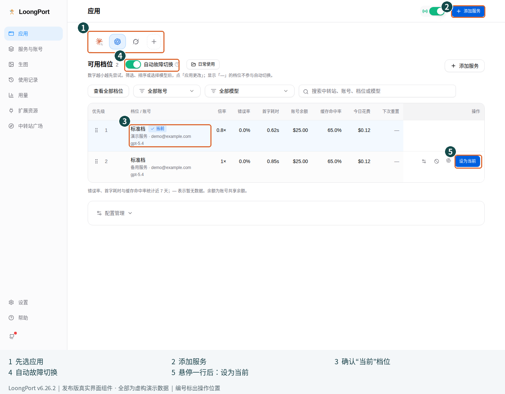

図の番号：① 管理するアプリを選択、② サービスを追加（添加服务）、③ 現在の接続設定（当前）を確認、④ 自動フェイルオーバー（自动故障切换）、⑤ 行にマウスを合わせて「使用する」（设为当前）を選択。

- **アプリ（应用）**：管理対象のアプリを選び、現在の接続設定、切り替え、予備の優先順位を管理します
- **サービスとアカウント（服务与账号）**：接続済みサービスのログイン、更新、残高、アカウント設定を管理します
- **画像生成（生图）**：画像生成用の接続設定で画像を作るか、CLI 向けの画像生成ツールを設定します
- **利用履歴 / 使用量（使用记录 / 用量）**：それぞれセッション履歴、リクエストや料金を確認します
- **拡張機能（扩展资源）**：MCP、Skills、Prompts、共通プロバイダー、アプリ別のワークスペースツールを管理します
- **中継サービス一覧（中转站广场）**：接続可能なサイトを探すか、自分のサービス URL を入力します。設定で変更するのはおすすめ一覧の表示です。一覧への入口や URL 入力機能はなくなりません
- **設定（设置）**：言語、表示するアプリ、接続、認証、バックアップ、更新を設定します

使いたいツールがアプリバーにない場合は、「その他のアプリ」または追加ボタンを開いてください。**設定 → 一般 → ホームページ表示** でも有効にできます。アプリの入口を表示しても、そのアプリ自体はインストールされません。

## 2 最初のアプリで会話する

まずは一つのアプリ、一つのサービス、一つの接続設定を動かします。二つ目のサービスや自動フェイルオーバーは、そのあとで追加してください。

### 2.1 接続方法を選ぶ

**サービスを追加（添加服务）** をクリックし、手元にあるものに合わせて選びます。

| 手元にあるもの | 選ぶ方法 |
| --- | --- |
| 中継サービスの URL とそのサイトのアカウント | **中継サービス（中转站）**。2.2 に進みます |
| DeepSeek、智譜 BigModel、opencode の公式 API アカウント | **公式 API（官方 API）**。2.3 に進みます |
| 提供元から受け取った API アドレス、API キー、モデル ID | **手動追加（手动添加）**。2.4 に進みます |
| cc-switch の設定を移行したい | まずバックアップしてから [6.3](#63-cc-switch-から移行する) を参照します |

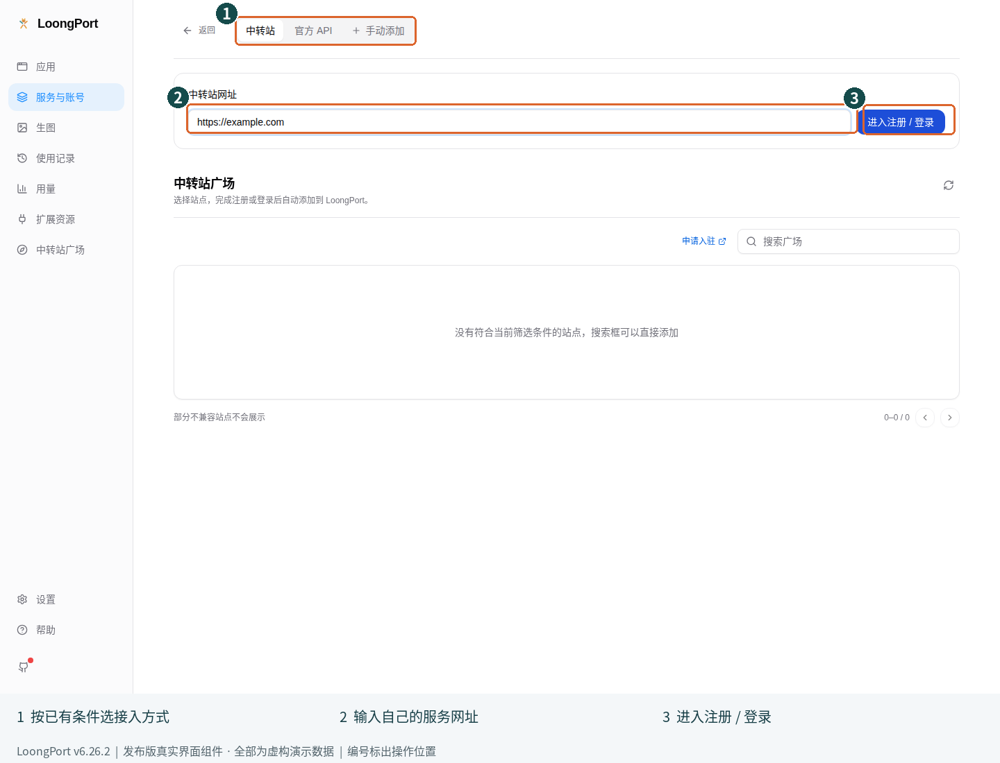

図の番号：① 既存のアカウントやキーに合う方法を選択、② サービス URL を入力、③ そのサービスの登録・ログインページを開く。

### 2.2 中継サービスのアカウントで接続する

**準備するもの：** 信頼できる提供元の URL、そのサイトの自分のアカウント、利用枠があり使用を許可された接続設定が一つ以上必要です。

1. 初回ウィザードの名前は **最初のサービスに接続（连接你的第一个服务）** です。「中継サービスの URL」にサービスのアドレスを入力します。例では `https://example.com` を使っていますが、実際のサービスアドレスに置き換えてください
2. **登録 / ログインへ進む（进入注册 / 登录）** をクリックします
3. 開いたページのドメインが、選んだサービスのものであることを確認します。アカウントがあればログインし、なければそのサービスの規則に従って登録します
4. ログイン後、LoongPort の **アプリの設定を確認（确认应用配置）** に戻ります
5. 今回使うアプリの接続設定を選び、ほかのアプリは **変更しない（暂不配置）** のままにします
6. 「サービスの利用状況と測定データを共有し、対応改善とコミュニティの測定結果の閲覧に参加する」と「共有する内容」の説明を読みます。中国語では「分享服务使用与实测数据」「了解分享内容」です。共有は任意で、選ばなくても利用できます。自分で選択してください
7. **設定を完了（完成设置）** をクリックします

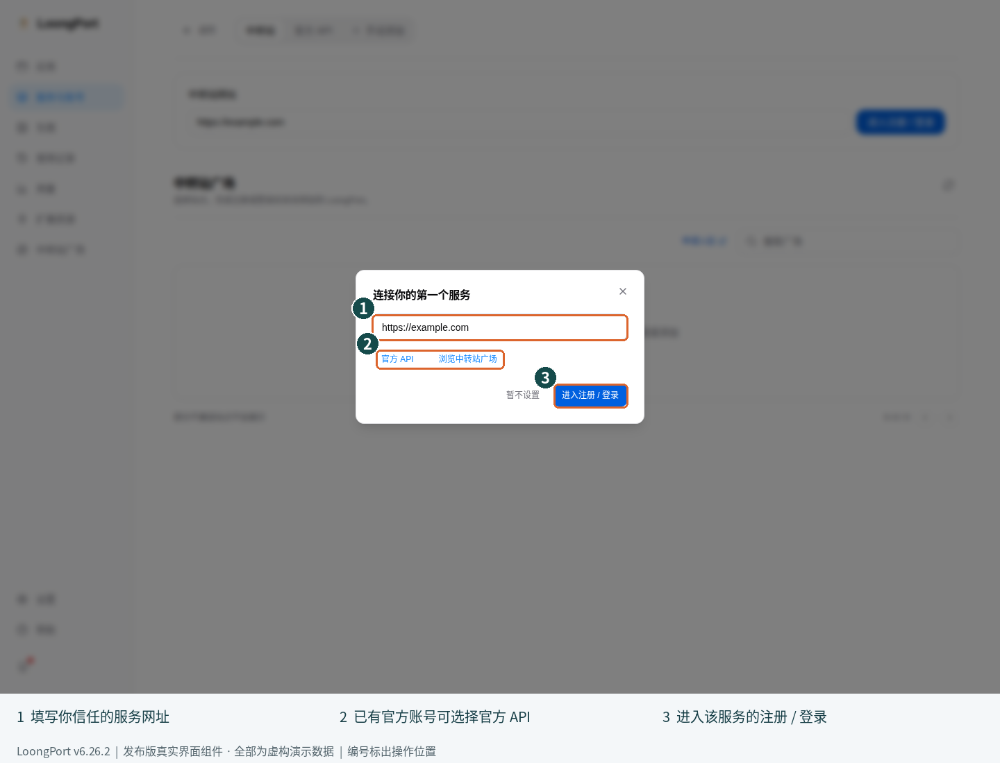

図の番号：① サービス URL。example.com は実際のアドレスに置き換えます、② 公式 API / サービス一覧への任意の入口、③ 選んだサイトを開く。

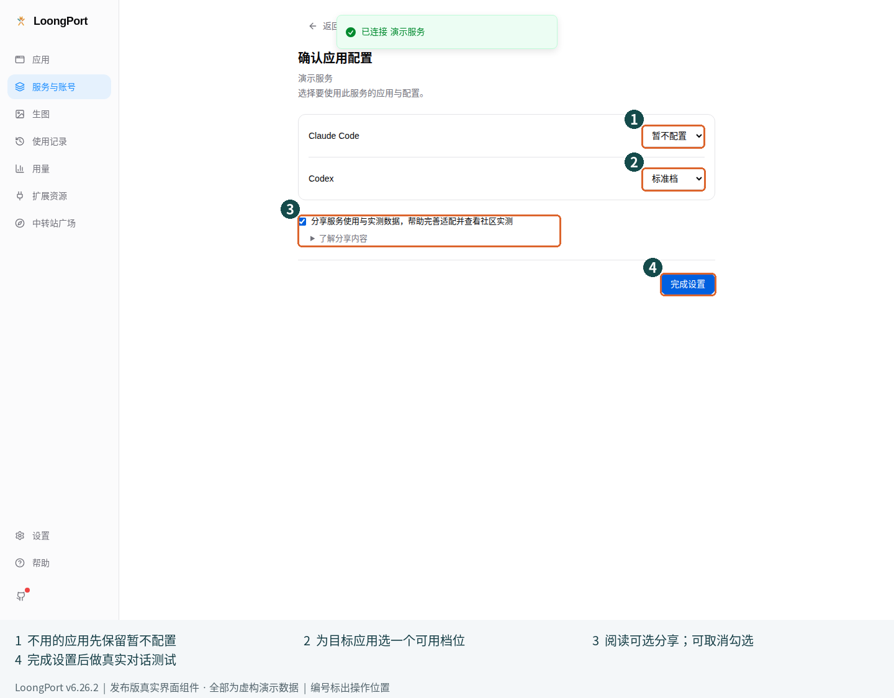

図の番号：① 使わないアプリは「変更しない」（暂不配置）、② 対象アプリの接続設定を選択、③ 任意のデータ共有を読んで自分で選択、④ 設定を完了（完成设置）。

LoongPort はサービスが提供する情報から利用可能な接続設定を取得し、選んだアプリに対応する形式で設定を書き込みます。サービスによっては API キーの作成や再利用が必要です。その対象は常に、自分が選んだサービスアカウントです。

**成功の目安：** 「サービスとアカウント」にアカウントが表示され、「アプリ」で接続設定と現在の設定を確認できます。そのあと、必ず [2.5 の実際の会話テスト](#25-実際に使えることを確認する) まで進めてください。

**うまくいかない場合：**

- ログイン画面を閉じた：登録 / ログインのボタンをもう一度押します。アカウントを重複登録する必要はありません
- アカウントは保存されたが設定がない：利用枠、サブスクリプション、グループ権限、モデル対応を確認し、アカウントを更新します
- 非対応サイトと表示される：対応する sub2api / new-api サービスか確認します。API キーがある場合は手動追加が使えるか確認できますが、任意のサイトへの自動ログインを保証するものではありません
- ログイン済みなのに期限切れと表示される：「サービスとアカウント」で再ログインします。パスワード、Cookie、ログイン応答を公開 Issue に貼らないでください

### 2.3 公式 API アカウントで接続する

1. **サービスを追加 → 公式 API** をクリックします
2. 画面に実際に表示される DeepSeek、智譜 BigModel、opencode から選びます
3. 提供元自身のページでログインします
4. **アプリの設定を確認** に戻り、対象アプリの設定を選んで **設定を完了** をクリックします
5. [2.5](#25-実際に使えることを確認する) の手順でテストします

「公式 API」は提供元の API サービスを指し、ChatGPT や Claude などのチャット製品のサブスクリプションとは別です。API の課金、プラン、使えるモデルは、アカウントの実際の権限によって決まります。opencode では複数のプラン設定が表示される場合があるため、利用権限のあるものを選んでください。

### 2.4 API キーだけがある場合は手動追加する

**次の四つを準備してください。不明な項目は提供元に確認します。**

| 項目 | 例 | 実際に入力するもの |
| --- | --- | --- |
| 名前 | `デモサービス` | 自分で識別できる名前 |
| API アドレス | `https://api.example.com/v1` | 対象アプリ用に提供元が指定した完全な Base URL。推測で `/v1` を追加しないでください |
| API キー | `REPLACE_WITH_YOUR_API_KEY` | そのサービスで発行されたキー。例の文字列をそのまま保存しないでください |
| モデル ID | `MODEL_ID_FROM_YOUR_PROVIDER` | 提供元のモデル一覧にある正確な ID。表示名と ID が同じとは限りません |

1. アプリバーで、**Codex** などの設定対象を先に選びます
2. **サービスを追加 → 手動追加** をクリックします
3. 初回に **共通設定について（关于通用配置）** が表示されたら、説明を読んで **わかりました（我知道了）** を選びます。対応するプリセットがあれば使い、なければ **カスタム設定（自定义配置）** を選びます
4. 名前、API アドレス、API キー、モデル情報を入力します。フォームはアプリによって異なります
5. サービスの対応プロトコルを確認します。OpenAI Responses、Chat Completions、Anthropic Messages は、名前が似ていても互換とは限りません
6. 保存して「アプリ」に戻り、新しい接続設定で **使用する（设为当前）** をクリックします
7. 次の節に従って対象アプリを再起動し、テストします

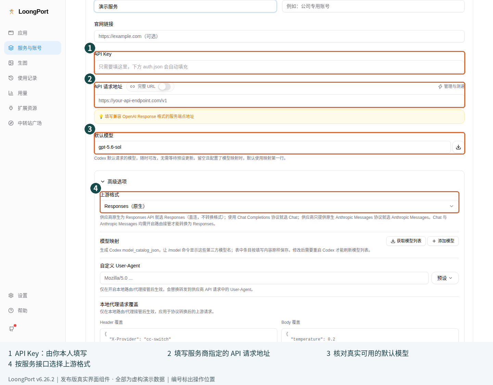

図の番号：① キーは自分で入力し、画像のプレースホルダーは使いません、② API リクエスト先を確認、③ サービスが実際に対応するモデルに変更、④ 上流の形式をサービスの API に合わせる。この画像ではキーの入力、保存、サービス呼び出しは行っていません。

**避けたい操作：** チュートリアルの JSON で既存の設定ファイル全体を上書きしないでください。実際のキーを公開チャット、スクリーンショット、Git に貼らないでください。「設定内容」の欄があっても、初心者が JSON を手書きする必要はありません。既存のフォームやプリセットを優先してください。

### 2.5 実際に使えることを確認する

1. **アプリ** に戻り、アプリ名が正しく、意図した接続設定に **現在（当前）** と表示されていることを確認します
2. 対象 CLI を終了して再起動します。Codex の設定は、設定を共有するデスクトップアプリにも影響する場合があります。終了・再起動の確認が出たら、作業を保存してから選択してください
3. 個人情報を含まない短いメッセージを送ります。例：`できることを一文で説明してください`
4. 通常の応答が返ることを確認してから、自分の作業を始めます
5. ローカルルーティングが有効なら、「使用量」で対応するリクエストも確認できます。ただし、これは補足の確認であり、実際の応答の代わりにはなりません

**次の状態だけでは成功とは判断できません：** ログイン成功、「保存済み」の表示、「現在」のマーク、ゼロでない残高。それぞれ別の段階を示しています。対象アプリがリクエストを送り、完了できることを確認してください。

`401/403`、モデルが見つからない、接続失敗などの場合は、[6.6 のトラブル対応表](#66-症状から対処する) を参照してください。原因を調べるために新しいキーを次々と作らないでください。

## 3 障害時に予備の接続設定へ自動で切り替える

### 3.1 このバージョンの対応範囲を確認する

**v6.26.2 の機能名は「自動フェイルオーバー」（自动故障切换）です。** 試してよい接続設定と優先順位を自分で決めます。現在のリクエストが失敗すると、適用済みの一覧に従ってほかの利用可能な接続設定を試します。

このバージョンには、古いチュートリアルの **「省心 / 自主」モード切り替え**はなく、**「価格が最も低い / 応答が最も速い」（价格最低 / 响应最快）設定を自動選択する機能**もありません。廃止された機能の説明と現在の自動フェイルオーバーを混同しないでください。一覧の倍率、エラー率、最初のトークンまでの時間を参考に、自分で順序を決めることはできます。

ローカルルーティングに完全対応する **Claude Code、Codex、Gemini、Grok Build** が対象です。アプリ標準のログイン、一部の公式アカウント、このルーティング方式に対応しない設定は自動切り替えに参加せず、画面に理由が表示されます。アプリを追加できても、すべての機能を使えるとは限りません。

### 3.2 初めて有効にする

**前提：** 第 2 章の会話テストが成功していること、対象 CLI の初期化が済んでいること、同じモデルに対応し、使ってよい接続設定が二つ以上あることです。一つしかない場合、スイッチを入れても予備のサービスは増えません。

1. **アプリ** を開いて対象を選びます
2. 「利用可能な接続設定」（可用档位）の横で **自動フェイルオーバー（自动故障切换）** を有効にします
3. 初期化、接続、設定に関する案内が出たら先に対応します。有効にするにはローカルルーティングが動作し、対象アプリの接続を管理している必要があります
4. 優先順位、現在の接続設定、対象外になっている理由を確認します
5. 対象アプリでもう一度テストメッセージを送り、有効化後も会話できることを確認します

図の番号：① 管理するアプリを選択、② サービスを追加（添加服务）、③ 現在の接続設定（当前）を確認、④ 自動フェイルオーバー（自动故障切换）、⑤ 行にマウスを合わせて「使用する」（设为当前）を選択。

**成功の目安：** スイッチが有効のままで、一時停止の案内がなく、対象アプリのリクエストも正常に完了します。接続を確認するには **設定 → 接続設定（连接设置）→ ローカルルーティング（本地路由）** を開き、動作状況と対象アプリの有効状態を確認します。

### 3.3 予備の順序を決めて変更を適用する

1. 自動フェイルオーバーを有効にしたら、**すべてのティアを表示（查看全部档位）** を選び、使いたい接続設定を探します
2. モデルを固定したい場合は **ティアモデル（档位模型）** で選択します。アカウントによる絞り込みや検索もできます
3. ドラッグで順序を変えるか、指標列をクリックして並べ替えます。**数字が小さいものほど先に試します。** 「—」の接続設定は自動切り替えの対象外です
4. **変更は未適用です（更改尚未生效）** と表示されたら、現在見えている一覧を一つずつ確認します
5. **変更を適用（应用更改）** をクリックします。実際の設定を変えない場合は **キャンセル（取消）** を選びます
6. 未適用の表示が消えたことを確認し、実際にリクエストを送ります

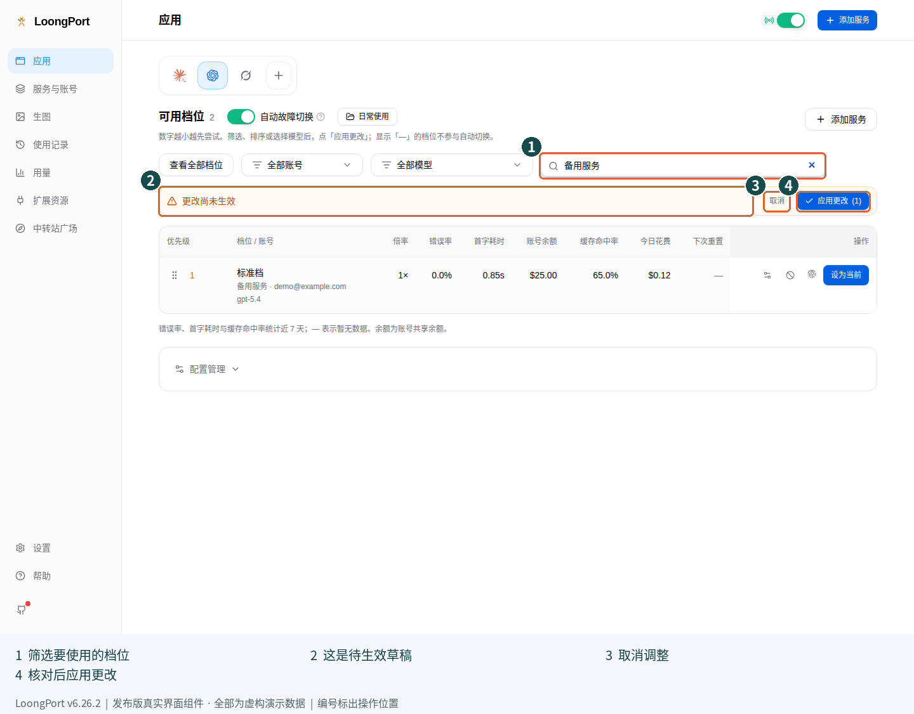

図の番号：① 現在の絞り込み条件、② 変更はまだ未適用（更改尚未生效）、③ 今回の変更を取り消す（取消）、④ 確認後に適用する（应用更改）。

**間違えやすい点：** 自動フェイルオーバーが有効な場合、絞り込み、並べ替え、モデルの選択で未適用の変更が作られることがあります。一覧を見ただけで運用中のリストが変わるわけではありません。「変更を適用」では選択したモデルも反映され、必要に応じて対応する接続設定が選ばれます。適用前にモデル、アカウント、一覧の範囲を確認してください。

指標欄の「—」はデータなし、または対象外を意味します。無料、エラーなし、残高無制限という意味ではありません。同じアカウントの残高が複数の行に表示される場合があるため、行ごとの残高を合計しないでください。

### 3.4 よく使う順序を保存する

「利用可能な接続設定」の横にある **順序プロファイル（配置档）** は、接続設定の順序を保存します。アプリ全体のバックアップではありません。

1. 一覧を使いたい順序に調整します
2. 順序プロファイルのメニューから **現在の順序を保存…（保存当前顺序…）** を選び、「普段使い」などの名前を入力します
3. 次回は保存済みプロファイルを選び、未適用の一覧を確認します
4. 画面の案内に従って **変更を適用** をクリックします

同じ名前で保存すると、その順序プロファイルを上書きします。順序プロファイルのインポート・エクスポートは並び順の移行用です。相手のサービスアカウント、キー、利用枠は作成されません。同じ接続設定がなければ完全には復元できません。

### 3.5 障害時に確認する表示

- **一時スキップ：接続の回復を待機中（暂时跳过：等待连接恢复）**：最近のエラー、サービスの利用枠、ネットワークを確認します。再試行を連打しないでください
- **スキップ：選択したモデルに非対応（不支持当前选择的模型）**：その接続設定が対応するモデルに変えるか、別の接続設定を選びます
- **ブロック済み（已屏蔽）**：自分で除外した接続設定です。再び使うと決めた場合だけ解除します
- **現在の公式ログインでは自動フェイルオーバーを利用できません（当前使用官方登录，不进行自动故障切换）**：公式ログインを使い続けるか、ルーティングに対応する API 設定を明示的に選びます
- **自動フェイルオーバーが一時停止中（自动故障切换已暂停）**：**接続を再開（恢复连接）** を選び、接続設定を確認します。スイッチが有効でも、リクエストがルーティングされているとは限りません

「エラー記録をクリア」しても、上流サービスの問題が直るわけではなく、キーの交換にもなりません。まずエラー情報を残して原因を調べ、そのあとで必要なら消去してください。

### 3.6 自動切り替えを止める場合と直接接続に戻す場合

次の三つの操作は影響が異なります。

| 目的 | 操作 | 結果 |
| --- | --- | --- |
| 障害時の自動切り替えを止めたい | アプリ画面で **自動フェイルオーバー** をオフにする | 自動切り替えを停止します。ローカルルーティングや接続管理は残る場合があります |
| 一つのアプリだけ直接接続に戻したい | **設定 → 接続設定 → ローカルルーティング → ルーティング有効（路由启用）** で対象アプリをオフにする | そのアプリの直接接続設定を復元します。ほかのアプリはルーティングを継続できます |
| ローカルルーティング全体を止めたい | 同じ画面の **ルーティング総スイッチ（路由总开关）** をオフにする | サービスを停止し、管理していた設定を復元します。依存するすべてのアプリに影響します |

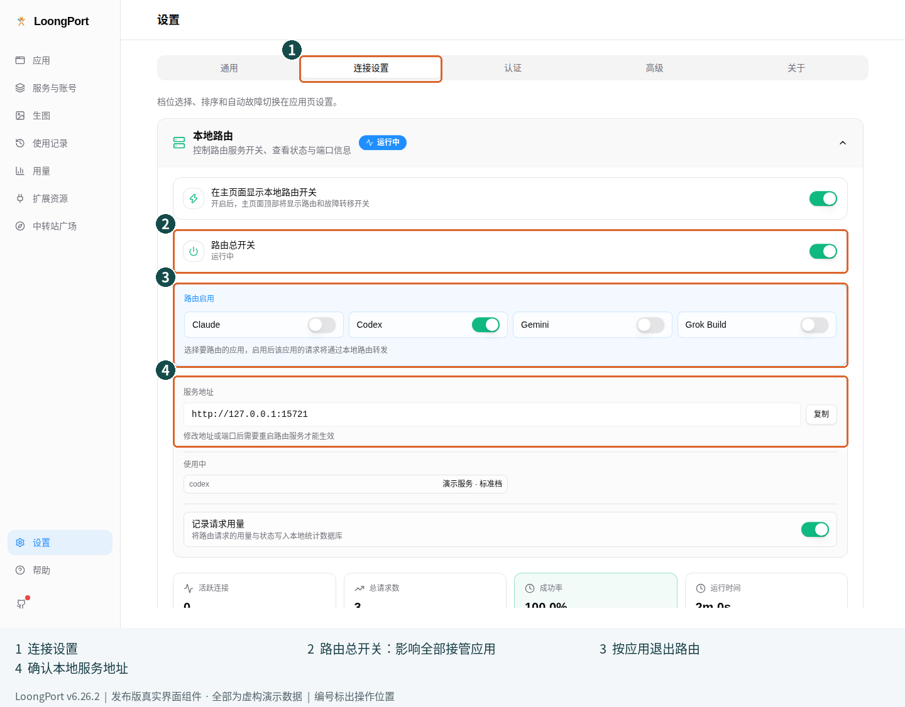

図の番号：① 接続設定（连接设置）、② 全アプリ共通のルーティング総スイッチ（路由总开关）、③ アプリ単位のルーティング（路由启用）、④ ローカルサービスのアドレスとポート。

復元後は対象アプリを再起動してテストします。接続が管理されたまま、バックグラウンドを終了したり、設定を削除したり、ポートを手動変更したりしないでください。対象アプリが停止済みのローカルアドレスを参照し続けることがあります。

## 4 日常のモデル切り替えとサービス管理

### 4.1 接続設定を手動で切り替える

1. **アプリ** で対象アプリを選びます
2. 切り替え先のサービス、アカウント、モデルが正しいか確認します
3. **使用する（设为当前）** をクリックします
4. 終了・再起動の確認が出た場合は、進行中の作業を処理してから選択します
5. 対象アプリを再起動し、テストメッセージを送ります

切り替え後のリクエストは、別のサービス提供元へ送られる場合があります。会話、コード、添付ファイルをそのサービスに渡してよいか、事前に確認してください。

### 4.2 モデルを変える前に対応状況を確認する

1. **ティアモデル（档位模型）** の絞り込み欄で使いたいモデルを選びます。モデルが全部で一つだけの場合、この欄は表示されません
2. そのモデルに明示的に対応する接続設定だけを使います。知らないモデル名は提供元の一覧で確認してください
3. **自動フェイルオーバーがオフの場合**：絞り込みは表示だけの変更です。対象行の **使用する** を押して初めて、その接続設定と選択したモデルが適用されます
4. **自動フェイルオーバーがオンの場合**：未適用のモデルと一覧を確認してから **変更を適用** をクリックします。絞り込み結果を適用済み設定と混同しないでください
5. 対象アプリで有効なモデルを確認し、短いテストを送ります

検索は設定を探すためのもので、利用権限の購入や非対応モデルの有効化はできません。モデル一覧の更新が遅れることもあります。サーバーが「モデルが存在しない」と返す場合は、提供元の実際の対応範囲を確認してください。

### 4.3 接続テストとモデル検証の違い

- **接続・速度テスト**：リクエストが完了するか、どの程度時間がかかるかを調べます。テスト自体に料金が発生する場合があります
- **モデル検証**：対応する管理対象の接続設定で、限られた証拠からモデルの振る舞いと表示上のモデルが一致するかを確認する補助機能です。公式認証や確定的な鑑定ではありません

モデルを検証するには：

1. 対応する接続設定の操作欄から **モデル検証（模型验证）** を開きます
2. その接続設定が提供するモデルを選びます
3. 案内を読んで検証を開始し、結果を待ちます。同じ処理を繰り返し送信しないでください
4. 結論と証拠を確認し、不明点は提供元に問い合わせます。中止したい場合はキャンセルを使います

異常マークがないことは、検証済みを意味しません。「データなし」もサービス品質が悪いという意味ではありません。一回の検証結果だけで断定的に非難しないでください。

### 4.4 ログイン期限切れ、更新、チャージと課金照合

1. **サービスとアカウント** で対象アカウントを選びます
2. ログインが期限切れなら再ログインします。ログインは有効でも接続設定が変わった場合は、アカウントを更新します
3. 利用枠が必要な場合は、そのアカウントのチャージ入口を使い、開いたページのドメイン、金額、プランを確認します
4. 費用を確認するには、ローカルの「使用量」を見たあと、サイトの使用量・請求画面または **課金照合（扣费对账）** を確認します

ログインセッションの期限切れと API キーの無効化は別です。セッションが切れても既存キーでリクエストできるアカウントもあるため、期限切れ表示だけで設定をすべて削除しないでください。

ローカルの推定費用と提供元の実際の請求では、料金表や集計期間が異なる場合があります。同じ期間で比較し、チャージ、別端末からの呼び出し、プラン、倍率、キャッシュ、課金方法の違いも考慮してください。一つの比率だけで過剰請求と判断することはできません。

### 4.5 カスタム設定、共通プロバイダー、公式ログインを管理する

- **カスタム設定の編集・複製**：アプリ画面で **設定管理（配置管理）** を展開します。サービスアカウントが生成した管理対象の設定は、「サービスとアカウント」の詳細で調整してください。更新後に変更が「消えた」と誤解するのを防げます
- **共通プロバイダー（统一供应商）**：**拡張機能 → 共通プロバイダー** で複数アプリ向けの設定を管理します。対象アプリ、プロトコル、モデルを個別に確認し、一つのアプリの形式をすべてに流用しないでください
- **既存の公式設定に切り替える**：対象アプリで既存の公式設定を選び、案内に従って再起動します。Codex の公式認証情報を保護するスイッチは「設定 → 一般」にあります。後述する「公式ログインに戻す」のリセット操作とは異なります
- **デスクトップアプリ**：Claude Desktop と Claude Code は設定形式が異なります。正しいアプリを選んでから、直接接続・モデルマッピングのフォームを使ってください。マッピングにはローカルルーティングが必要で、CLI の操作をすべてそのまま適用できるわけではありません

OpenCode、OpenClaw、Hermes、Pi はそれぞれのネイティブ設定方式を使い、複数のプロバイダーを同時に保持できる場合があります。「有効化」が常に全体で一つだけの選択を意味するわけではありません。最終的なモデル選択は、各アプリ自身の画面で確認してください。

### 4.6 サブスクリプション認証アカウントを管理する

**設定 → 認証 → OAuth 認証センター** には、GitHub Copilot、ChatGPT（Codex OAuth）、xAI（Grok OAuth）の三つのアカウント欄があります。この機能は UI 上で **Beta** と表示されます。「公式 API」のアカウントとは別で、どのサブスクリプションでも任意のアプリで使えるという保証はありません。

1. サブスクリプション、用途、対象アプリが各プラットフォームの規約に合うことを確認してから、該当する欄を開きます
2. ログイン・アカウント追加を選び、そのプラットフォーム自身の認証ページで操作します。第三者のページにプラットフォームのパスワードを入力しないでください
3. LoongPort に戻り、正しいアカウントが表示されていることを確認します。複数ある場合は必要に応じて既定のアカウントを選びます
4. この認証方式に対応するプロバイダーのフォームで、該当するアカウントを選びます。既定のアカウントを設定しただけでは、対象アプリのプロバイダーは切り替わりません
5. 再ログインが必要と表示されたら、そのアカウントの入口からやり直します。不要になったアカウントを削除する前に、依存する設定を確認してください

成功の目安は、認証済みアカウントが認識され、対象設定に正しく関連づけられ、実際のリクエストが完了することです。一覧に一行表示されただけでは、すべての呼び出しが使えるとは判断できません。認証応答、Cookie、トークン、復旧コードを共有しないでください。

### 4.7 ChatGPT の標準ログインに戻す必要がある場合

LoongPort の Codex ルーティングを解除し、公式ログインをやり直す必要がある場合だけ使います。通常の接続設定の切り替えには不要です。

1. ChatGPT で進行中の作業を保存します
2. **設定 → 認証 → ChatGPT（Codex OAuth）** を開きます
3. **公式ログインに戻す（恢复官方登录）** を選び、確認内容を読みます。ChatGPT を終了し、LoongPort のルーティングを解除して、バックアップ後に現在の Codex ログイン状態を削除します
4. 確認後に ChatGPT を開き直し、**公式アカウントに再ログイン**してテストします

**Windows の注意点：** この操作は ChatGPT を強制終了し、保存を促す表示は出ません。ログイン状態のバックアップは、後から自動ログインできる保証ではありません。自分で公式ログインを完了できることを確認してください。

## 5 画像生成と履歴、使用量、拡張機能

### 5.1 LoongPort で画像を生成する

**準備するもの：** 画像生成用のグループと利用枠があるサービスアカウントです。通常のチャット用の接続設定が画像生成にも対応しているとは限りません。

1. サービスアカウントを追加または更新し、**画像生成（生图）** ページに画像生成用の接続設定が表示されるようにします
2. **画像生成** を開きます。接続設定を管理する場合は **接続プロファイル（接入配置）** を選び、使いたい設定を有効にします
3. **生成** に戻り、**現在の接続プロファイル（当前接入配置）** を確認します
4. 作りたい画像を説明し、対応するサイズ、品質、枚数を選びます。最初は **1 枚** にしてください
5. **生成** をクリックし、**生成履歴（生成记录）** に結果が表示されるまで待ちます
6. **フォルダで表示（在文件夹中显示）** で実際のファイルを確認します

枚数は料金に影響し、同時に送信すると複数のリクエストが並行して実行される場合があります。時間がかかっても生成ボタンを繰り返し押さず、まず待ってください。一部だけ成功した場合は、成功した画像を保存してから失敗した分に対応します。

接続プロファイルが表示されない場合は、サービスが画像生成用のグループを提供しているか確認してください。チャットモデルの名前を画像モデルに書き換えるだけでは使えません。

### 5.2 CLI の会話で画像生成ツールを使う

1. 前の節に従って、画像生成用の接続プロファイルを選びます
2. 「画像生成」ページで **Codex / Claude の会話に画像生成ツールを提供** を確認します。このバージョンでは既定で有効です。無効にしていて必要になった場合は、手動で有効にします
3. このバージョンでツールが登録される対象は **Codex、Claude Code、Gemini CLI** です。初回の書き込み後や再び有効にした後は、使う CLI を再起動してツール設定を読み込み直します
4. 会話の中で画像生成ツールを使うよう明示的に依頼し、CLI に表示されるツールの確認内容と結果を確認します

画像生成の設定とチャット用の接続設定は独立しています。画像を作るために正常なチャット設定を切り替える必要はありません。ツールを呼び出すかどうか、権限の確認、出力先は、現在の CLI と画面の表示で確認してください。

### 5.3 使用量とリクエストのエラーを確認する

1. 左側の **使用量（用量）** をクリックします
2. まず日付の範囲を選び、次にアプリ、プロバイダー、モデルで絞り込みます
3. リクエスト数、トークン、費用、推移を確認し、関連するリクエストの記録を開いてエラーを調べます
4. 課金を照合する場合は、時刻、対象アプリ、モデルを記録します。提供元に情報を送る前に、キー、アカウント、会話内容を取り除いてください

記録がない場合は、収集元、日付の範囲、ローカルルーティングの「リクエスト使用量を記録」（记录请求用量）を確認します。別の端末、記録されない経路、非対応アプリからのリクエストは、ここに表示されない場合があります。グラフが空でも、費用が一切発生していないとは限りません。

### 5.4 過去のセッションを探して再開する

1. **利用履歴 → セッション履歴（使用记录 → 会话历史）** をクリックします
2. 対象アプリを選び、タイトルや内容で検索します
3. セッションを選び、プレビューで探していた内容か確認します
4. セッションの再開や復元コマンドが表示される場合は、そのアプリに対応する方法で再開します

すべてのアプリで直接再開できるわけではありません。別のサービスで過去のセッションを続けようとすると、元のサービス専用の暗号化された推論内容が履歴に含まれる場合などに、失敗することがあります。まず新しいセッションで現在の設定をテストし、履歴形式の問題をキーの無効化と混同しないようにしてください。

**Codex の公式サービスとサードパーティのセッションを一つにまとめたい場合：**

1. **設定 → 一般 → Codex アプリ拡張 → Codex セッション履歴を統一（统一 Codex 会话历史）** を開きます
2. 有効にするときは確認画面を読み、既存の公式セッションも移行するか決めます。移行前には自動でバックアップされます
3. セッション履歴で結果を確認し、新しいセッションを開いて現在の設定をテストします
4. 無効にするとき、移行時のバックアップがあれば、そのとき取り込んだセッションを復元できます。復元する場合は選択肢をよく読んでください。スイッチを切るだけですべての履歴が元に戻るわけではありません

履歴を統一しても、サービスをまたぐ暗号化された推論内容の互換性は保証されません。新しいセッションは使えて過去のセッションだけ失敗する場合は、まず履歴の互換性を確認してください。

セッションにはコード、ファイルパス、添付ファイル、個人情報が含まれる場合があります。スクリーンショットの共有やエクスポート前に一つずつ確認し、調査しやすくするためにセッションのディレクトリ全体を公開しないでください。

### 5.5 MCP でツールやデータソースを接続する

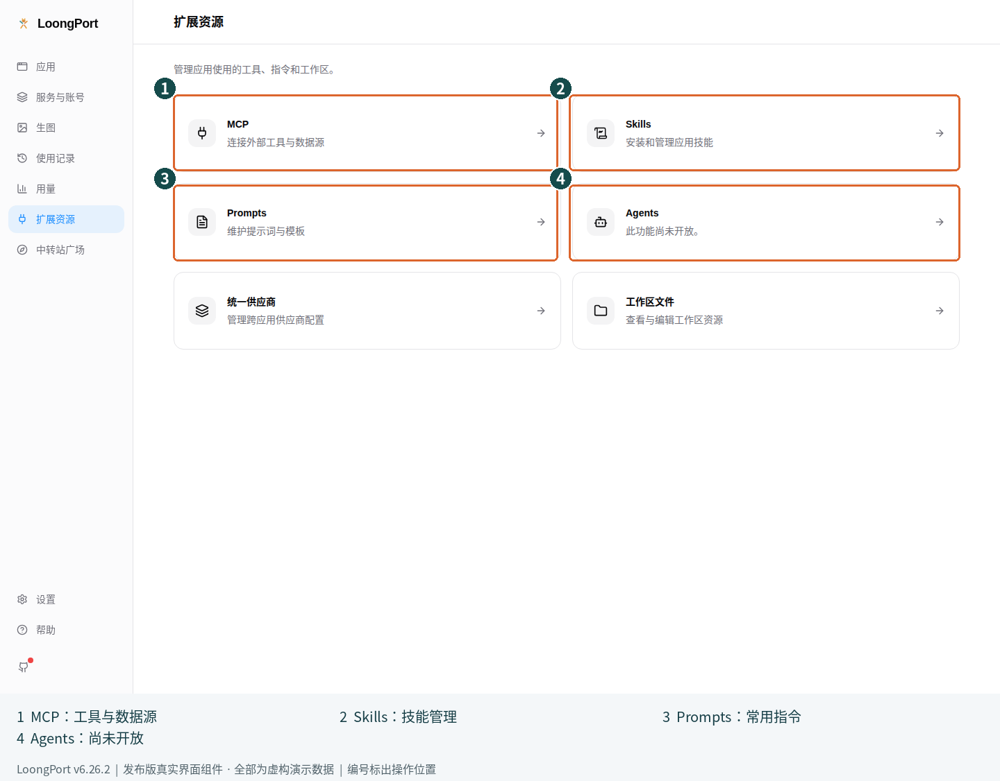

図の番号：① MCP でツール接続を管理、② Skills でスキルを管理、③ Prompts でよく使う指示を管理、④ 汎用の Agents はまだ利用できません。

1. 対象アプリを先に選び、**拡張機能 → MCP（扩展资源 → MCP）** を開きます
2. 信頼できる MCP サービスを追加するか、自分の既存設定をインポートします
3. サービスの公式手順に従って、起動コマンドまたは接続先アドレスと必要なパラメーターを入力します
4. 同期するアプリを選んで保存します
5. 設定の再読み込みが必要な対象アプリを再起動し、ツールが認識されることを確認します

MCP はローカルプログラムの実行、ファイルの読み取り、外部サービスへのアクセスを行う場合があります。必要な権限を先に確認し、出所不明の設定にある実行コマンドをそのまま使わないでください。認証情報も公開リポジトリに置かないでください。Pi には同じ形式のネイティブ MCP 登録機能がなく、このバージョンでは未対応の登録機能を作ることはありません。

### 5.6 Skills をインストールして同期する

1. **拡張機能 → Skills** を開きます
2. 信頼できる提供元からスキルを探すか追加し、内容と出所を確認します
3. インストール後に対象アプリを選び、同期状態を確認します
4. 対象アプリに戻り、そのアプリのスキルの使い方に従ってテストします
5. 更新前には変更内容を確認します。不要になった場合は管理画面からアンインストールし、影響範囲を確認してください

スキルは説明文だけでなく、スクリプトを含むこともあります。検索結果に表示されたという理由だけで安全だと判断しないでください。保存場所、同期方法、対応するアプリは Skills の管理画面で確認します。

### 5.7 Prompts でよく使う指示を保存する

1. 対象アプリを先に選び、**拡張機能 → Prompts** を開きます
2. 新しい項目を作り、名前と繰り返し使いたい指示を入力します
3. 保存後に有効にします。切り替える前に、そのアプリの指示ファイルに書き込まれるか確認してください
4. 対象アプリで指示が読み込まれていることを確認します

指示ファイルとその適用範囲はアプリによって異なります。Pi のシステムプロンプト、プロジェクトの指示、テンプレートにもそれぞれの入口があります。公開して共有する予定のテンプレートに、パスワードやプロジェクトの機密情報を保存しないでください。

### 5.8 プロジェクトの切り替えとアプリ別のワークスペースツール

**プロジェクトの切り替えは、設定の組み合わせを繰り返し切り替えるための機能です。初回設定に必須ではありません。**

1. **設定 → 一般** で **プロジェクト切り替えを表示（显示项目切换）** を有効にします
2. 現在のアプリのプロバイダー、MCP、Skills などを希望する状態にしてから、上部のプロジェクトメニューで **新規プロジェクト（新建项目）** を選び、名前を付けて現在のスナップショットを保存します
3. 次回から、メニューで保存済みプロジェクトを選ぶと、該当するアプリグループのスナップショットがすぐに適用されます。作業を始める前に、現在のプロバイダーと拡張機能が正しいか確認してください
4. 切り替えを戻したい場合は、以前に保存したプロジェクトを再び適用します。**プロジェクトを使用しない（不使用项目）** は関連付けを解除するだけで、**実際の設定を切り替え前の状態に戻す操作ではありません**

Claude Code、Claude Desktop、Codex は独立した三つのグループで、それぞれスナップショットを保存・適用します。一方の切り替えによって、もう一方が保存・切り替えられるわけではありません。同じプロジェクト名でも、すべてのアプリでスナップショットが保存済みとは限りません。「このアプリ側は未保存」（本侧未保存）なら、そのアプリ側の設定範囲を先に確認してください。切り替え時には現在の設定が元のプロジェクトに保存されるため、大きな試行をする前には別途バックアップを残します。

アプリごとに表示されるほかのツール：

- **ワークスペースファイル（工作区文件）**：「拡張機能」から開き、現在のアプリと対象ディレクトリを確認してから該当ファイルを編集します。先にファイルの用途を理解し、個人用ディレクトリ全体をワークスペースにしないでください
- **OpenClaw**：OpenClaw に切り替えると、拡張機能に「環境変数」「ツール権限」「Agent の既定設定」などが表示されます。権限を変える前に影響を確認してください
- **Hermes**：Hermes に切り替えると、永続メモリの確認・編集やローカル管理画面へのアクセスができます。メモリを削除すると今後の動作に影響するため、必要な内容を先に保存してください
- **Agents**：汎用の Agents ページは現在「この機能はまだ利用できません。」という案内のみです。ここから汎用の自律エージェントを作成・管理することはできません

これらは必要に応じて使う高度な機能です。初日は一度会話できる状態になれば十分で、すべての入口を開く必要はありません。

## 6 設定・バックアップ・更新とトラブル対応

### 6.1 言語、外観と認証情報の保護

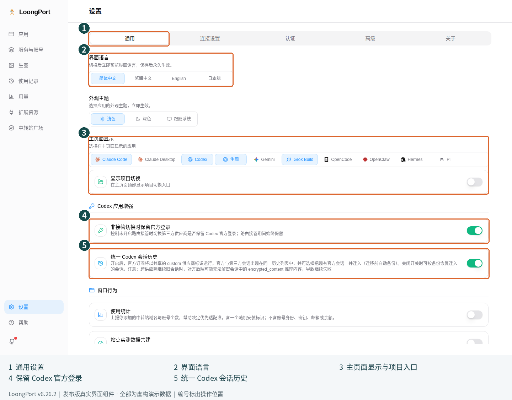

図の番号：① 一般（通用）、② 言語、③ ホームページのアプリ・プロジェクト表示、④ Codex の公式ログインを保持、⑤ Codex セッション履歴を統一。

- **言語とテーマ**：設定 → 一般で、表示言語とライト・ダーク・システムに合わせる表示を選べます
- **アプリの入口**：設定 → 一般 → ホームページ表示で、実際に使うアプリを有効にします
- **認証情報の保護（凭据保护）**：設定 → 認証にあります。既定ではシステムの資格情報ストアを使います。利用できない場合、初回起動時に保護パスワードの設定を求められることがあります
- **保護パスワード（保护口令）**：自分で設定し、安全に保管してください。スクリーンショット、Git、チャットに載せないでください。別の端末で復元するときに必要になる場合があり、サービスアカウントのパスワードでは代用できません
- **クラウド同期（云同步）**：設定 → 詳細 → クラウド同期にあり、WebDAV または S3 互換ストレージに対応しています。初めて端末間で移行するときは [6.4](#64-インポートエクスポートと順序プロファイルの違い) の順番に従ってください

**初回設定で選んだ共有内容を変更するには：** 設定 → 一般 → ウィンドウ動作で、**利用統計（使用统计）** と **サイト実測データの共同利用（站点实测数据共建）** をそれぞれ変更します。二つのスイッチは独立しています。無効にすると、そのスイッチに対応する今後の共有は停止しますが、受信側にある既存のデータが自動削除されるわけではありません。

初回起動時にシステムの資格情報ストアが利用できないと表示された場合は、システムの認証情報サービスやセッションの状態を確認するか、アプリの案内に従って自分で保護パスワードを設定します。この画面を飛ばすために認証情報ファイルを削除しないでください。

### 6.2 大きな変更の前にバックアップする

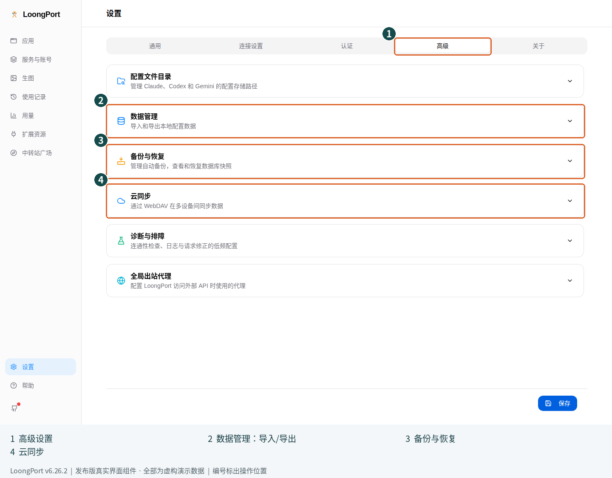

図の番号：① 詳細（高级）、② データのインポート・エクスポート、③ ローカルのバックアップと復元、④ クラウド同期。

1. **設定 → 詳細 → バックアップと復元（备份与恢复）** を開きます
2. 手動でバックアップを作成し、一覧に新しいスナップショットが表示されたことを確認します
3. **別の端末へエクスポートする場合は、先に「設定 → 認証 → 認証情報の保護」で保護パスワードを設定してください**。システムの資格情報ストアが正常でも必要です。保護パスワードがないとエクスポートは拒否されます
4. 次に **設定 → 詳細 → データ管理 → SQL バックアップをエクスポート（导出 SQL 备份）** で、自分で管理する場所に保存します。このバックアップを作ったときの保護パスワードも保管してください
5. バックアップと復元に必要なものが揃ったことを確認してから、更新、移行、大きな設定変更を行います

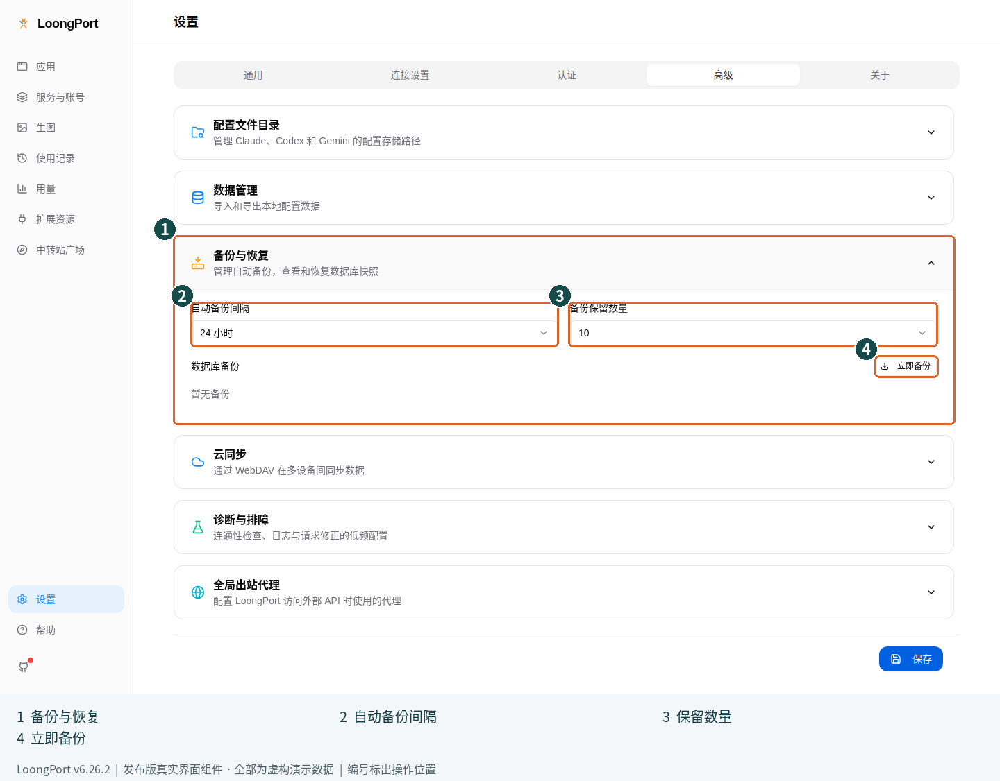

図の番号：① バックアップと復元を展開、② 自動バックアップ間隔、③ バックアップ保持数、④ 今すぐバックアップ（立即备份）。

ローカルのスナップショット、移行用エクスポート、クラウド同期はそれぞれ異なります。バックアップは公開してよいサンプルではありません。サービス設定、アカウント情報、認証情報に関するデータを含む場合があり、暗号化されていてもアクセスを制限してください。

復元するときは、まず現在の状態をバックアップし、正しいスナップショットまたはエクスポートファイルを選びます。暗号化されたバックアップのインポートには、**そのバックアップを作ったときの保護パスワード**を入力します。インポートは設定を置き換えますが、端末のログイン情報と同期認証情報は保持され、端末の保護パスワードも変わりません。旧版の暗号化されていないバックアップにはパスワードは不要です。上書きの案内を読んでから確定してください。復元後は「インポート成功」の表示だけでなく、サービス、アプリの現在の接続設定、実際のリクエストを確認します。

### 6.3 cc-switch から移行する

1. 元のツールでバックアップを残し、同じ設定を同時に変更するツールを終了します
2. LoongPort の **設定 → 詳細** を開きます
3. インポートできる cc-switch のデータが検出されると、**cc-switch からインポート（从 cc-switch 导入）** が表示されます。表示されなくても、データベースを自己判断でコピーしないでください
4. インポートのプレビューを開き、範囲と件数を確認してから確定します
5. 移行後にアプリ、現在のプロバイダー、拡張機能を一つずつ確認し、実際のリクエストを完了させます

移行では対応する設定をコピーします。cc-switch の元データを削除する必要はありません。移行元のバージョンが新しすぎる場合や、データが存在しない場合は入口が表示されないことがあります。二つのツールで同じアプリの設定を同時に切り替えないでください。

### 6.4 インポート・エクスポートと順序プロファイルの違い

| 名称 | 主な用途 | 誤解しやすい点 |
| --- | --- | --- |
| 設定のインポート・エクスポート | アプリデータの移行や復元 | 安全に公開できる説明ファイルではありません |
| バックアップと復元 | ローカルの過去のスナップショットに戻す | どの旧バージョンとも必ず互換性があるわけではありません |
| 自動切り替えの横にある順序プロファイル | 接続設定の優先順位を保存する | サービスアカウントやキーを含む完全なバックアップではありません |
| プロジェクト切り替えのスナップショット | 対応範囲のプロジェクト設定をまとめて切り替える | 一つの並び順だけを変えるものではありません |

出所不明のインポートファイルやディープリンクを受け取ったら、対象アドレス、アプリ、内容を先に確認してください。設定のインポートによってリクエストの送信先が変わることもあります。「直してあげる」と言われただけで確定しないでください。

#### 初めて別の端末へデータを移行する

1. **完全なデータがある古い端末**でバックアップを取り、復元に使える保護パスワードを準備します
2. **設定 → 詳細 → クラウド同期** を開き、**WebDAV** または **S3互換ストレージ** を選びます。信頼できるストレージサービスの接続情報、リモートディレクトリまたはオブジェクトパス、同期設定名を入力します
3. **接続テスト（测试连接）** をクリックして正常に接続できることを確認し、**設定を保存（保存配置）** を選びます。保存後の接続テストの結果も確認してください。認証情報は自分で入力し、スクリーンショットや公開の説明に載せないでください
4. 古い端末で **クラウドにアップロード（上传到云端）** を選び、保存先とスナップショットの情報を確認します。**確定すると、その場所にある既存の同期データを上書きします**
5. 新しい端末で同じ保存先を設定し、先に **クラウドからダウンロード（从云端下载）** を選びます。移行元の端末、日時、内容を確認し、端末に既存データがあればバックアップしてから復元を確定します。**ダウンロードして復元すると、端末のデータとスキル設定が置き換わります**
6. クラウドの保護設定を復元するよう求められた場合は、クラウドのスナップショットの保護パスワードを入力し、案内に従います。このクラウド復元は通常の設定インポートとは異なり、復元後に端末がクラウドのスナップショットの保護パスワードを使うようになる場合があります
7. サービス、拡張機能、実際のリクエストが正常に動くことを確認してから、**自動同期（自动同步）** を有効にするか決めます。自動同期はローカルデータベースの変更後にアップロードする機能で、複数端末の競合を自動で解決する保証ではありません

**新しい端末から空のデータを先にアップロードしないでください。** WebDAV と S3 を切り替えるときは有効状態を確認してください。二つの方式は同時に書き込まれる二重バックアップではありません。クラウドにデータがない、またはバージョンに互換性がない場合は復元を止め、保存先のディレクトリとバージョンを確認します。上書きを繰り返して試さないでください。

### 6.5 更新する場合と以前のバージョンに戻す場合

1. 更新前に 6.2 の手順でバックアップし、作業中の内容を保存します
2. **設定 → バージョン情報（关于）** を開き、現在のバージョンと更新案内を確認します
3. 安定版を使う場合は、ベータ版の更新を無効のままにします。ZCode などのベータ機能が必要な場合だけ、ベータチャンネルを検討してください
4. インストール後に再び起動し、バージョン、現在の設定、実際のリクエストを確認します

Windows のインストーラー版、macOS、Linux AppImage はアプリ内更新に対応しています。Windows Portable と Linux の `.deb` / `.rpm` は、それぞれの配布方式に従って更新してください。インストーラー版と同じ手順は使えません。

以前のバージョンに戻す場合は、アプリを終了し、公式 Releases から動作確認済みの旧バージョンを選び、互換性のあるバックアップを準備します。**古いプログラムで新しいデータベースを直接上書きしないでください。** データベースのバージョンが新しすぎると表示された場合は、既存データを残したまま、復元画面やリリースの説明に従います。データベースの削除を切り戻しの手順にしないでください。

### 6.6 症状から対処する

| 症状 | 最初に確認すること | 最初に避けること |
| --- | --- | --- |
| Codex や Claude などの入口が見つからない | その他のアプリ、または 設定 → 一般 → ホームページ表示を確認します | すべてのプログラムを再インストールする |
| アプリの設定が見つからない | 対象アプリをインストールして一度起動し、設定のディレクトリを確認します | 既存の設定ディレクトリを削除する |
| ログインできたが接続設定がない | サービスのグループ、プラン、利用枠を確認し、アカウントを更新します | 登録やキー作成を繰り返す |
| 切り替えても古いサービスが使われる | 選択したアプリと「現在」の設定を確認し、対象アプリを再起動して環境変数の競合を調べます | LoongPort の一覧だけを更新する |
| `401` / `403` | サービスのアドレス、キーの権限と有効性、対応するアカウントを確認します | 助けを求めるためにキーを公開する |
| モデルが存在しない、または非対応 | 提供元の一覧で正確なモデル ID とプロトコルを確認します | 表示名だけを使いたいモデルに変更する |
| `127.0.0.1` に接続できない | ローカルルーティングの動作と対象アプリの接続管理を確認し、接続を再開するか 3.6 に従って直接接続に戻します | ポートを無作為に変える、設定を復元せずバックグラウンドを終了する |
| 自動切り替えが有効なのに動かない | 一時停止の表示、ルーティング、モデルの互換性、適用済み一覧を確認します | スイッチが有効なだけで成功と判断する |
| 並べ替えても変化がない | 「変更は未適用です」を確認し、変更を適用するかキャンセルします | 適用せずにドラッグを繰り返す |
| 使用量のグラフが空 | 日付、アプリの絞り込み、記録元を確認し、ルーティングの記録を有効にしてテストします | 費用が一切発生していないと判断する |
| 画像生成ページに接続設定がない | 画像生成用のグループがアカウントにあるか確認し、サービスを更新します | チャットモデルの名前を画像モデルに変える |
| 新しいセッションは使えるが過去のセッションを再開できない | 提供元をまたぐ履歴の互換性を確認し、元の記録を保存します | すぐにすべてのキーを交換する |
| 更新のダウンロードに失敗する | ネットワークと公式 Releases を確認し、正しいパッケージで手動更新します | 知らないミラーの「修復パッケージ」を使う |
| ロック解除やインポートに失敗する | 保護パスワード、システムの資格情報ストア、バージョン、ファイルの出所を確認します | 暗号化ファイルを削除する、データベースを公開する |

**解決しない場合は、次の情報をまとめてください：**

- LoongPort のバージョン、OS、対象アプリのバージョン
- どの画面から始めて何をクリックし、何を期待して、実際に何が起きたか
- エラーの文章と発生時刻、新しいセッションでも再現するか
- アカウント、キー、ドメイン、パス、会話内容を隠したスクリーンショット
- ログが必要なら診断機能から取得し、内容を先に確認します。個人用の設定ディレクトリ全体をアップロードしないでください

公開の報告には [公式 Issues](https://github.com/SailingLoong/LoongPort/issues) を使います。セキュリティの脆弱性や機密情報を含むデータについては、先に [セキュリティポリシー（英語）](../../SECURITY.md) を読み、直接公開しないでください。

### 6.7 必要なときだけ変更する高度な設定

- **カスタムの設定ディレクトリ**：設定 → 詳細 → 設定ディレクトリ（配置文件目录）。対象アプリの実際のディレクトリを選び、保存して案内に従って再起動します。アプリが本当にカスタムディレクトリを使っている場合だけ変更してください。パスが違うと、変更が反映されないように見えることがあります
- **グローバル送信プロキシ（全局出站代理）**：設定 → 詳細 → グローバル送信プロキシ。信頼できるプロキシアドレスを入力し、接続をテストして保存します。アドレスを消した場合も保存が必要です。LoongPort の外部への接続に影響する設定で、端末内で AI リクエストを転送する「ローカルルーティング」とは別です
- **ツールのバージョンとインストール診断**：設定 → バージョン情報で、対象 CLI のバージョン、インストール状態、診断情報を確認します。OS に合う案内か確認してからインストールや更新を行い、クライアントのインストール不良をサービスアカウントの問題と混同しないでください
- **診断とトラブル対応**：設定 → 詳細でログ、接続チェック、リクエストの補正を調整できます。既定値で正常なら、タイムアウト、再試行、補正ルールを変更する必要はありません。問題を報告するときは最小限の再現手順を残し、原因が明確になってから設定を変えてください

## ベータ版付録 ZCode

**v6.26.3-beta.2 のみが対象です。安定版 v6.26.2 にはこの入口はありません。** ZCode を使わない場合は読み飛ばしてください。

1. ZCode を先にインストールして起動し、個人設定用のディレクトリを確認します
2. ベータ版の LoongPort でアプリバーの追加ボタンを使うか、設定 → 一般 → ホームページ表示で **ZCode** を有効にします
3. ZCode のページを開き、個人プロバイダーを追加します
4. サービスのアドレス、API キー、プロトコルを入力します。プロトコルは Anthropic Messages、OpenAI Chat Completions、OpenAI Responses のいずれかです
5. 提供元のモデル ID を一行に一つずつ入力し、保存します
6. ZCode に戻り、そのプロバイダーとモデルを選んでテストします

このページで管理するのは個人プロバイダーとモデル ID のみです。アカウントのログイン、既定のモデル、プロキシ、MCP、Skills、高度なモデル機能のパラメーターは引き続き ZCode で管理します。別の方法で登録された個人プロバイダーは読み取り専用の場合があります。

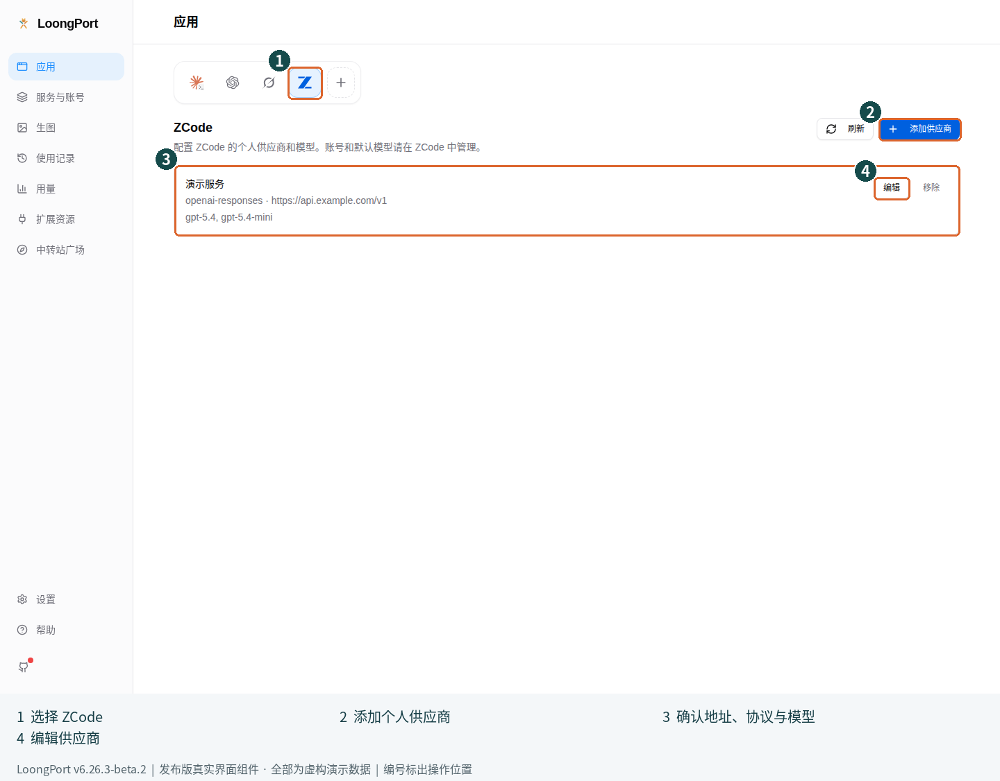

図の番号：① ZCode アプリ、② 個人プロバイダーを追加、③ 保存済みのアドレス・プロトコル・モデル、④ 編集（编辑）。

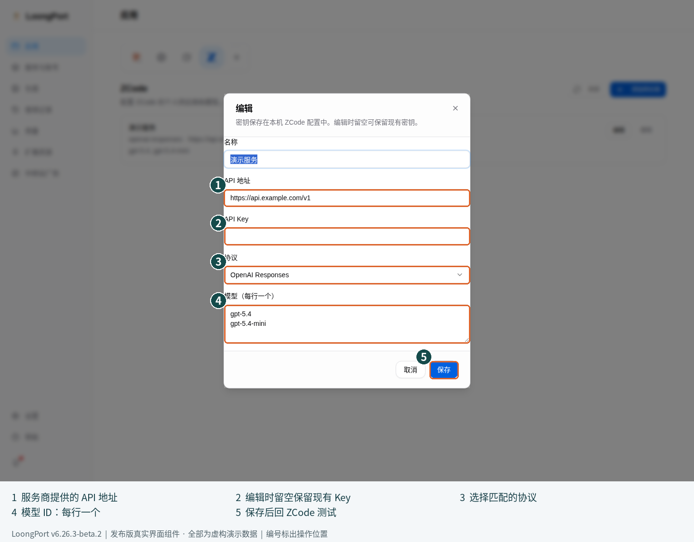

図の番号：① API アドレス、② 編集時はキーを空欄にすると既存のキーを保持。新規作成時は自分で入力、③ プロトコル、④ モデル ID を一行に一つずつ入力、⑤ 保存後に ZCode でテスト。例のモデル名が自分のサービスでも提供されているとは限りません。

既存のプロバイダーを編集する場合、キーが空欄なら現在のキーを保持します。削除前には確認が表示されます。外部での変更との競合が起きた場合は、編集をキャンセルして更新し、再び開いてください。強制的に上書きしないでください。カスタムの設定ディレクトリを使う場合は、場所を推測せず [ZCode 専用ガイド（中国語）](../zcode.md) で確認してください。

## 次のステップ

初めて使う場合は、対象アプリが正常に応答できれば基本設定は完了です。その後、必要に応じて予備の接続設定を追加し、使用量を確認し、ツールを接続してください。まず一つの使い方を確実に動かしてから、できることを増やしていきましょう。

---

スクリーンショットのバージョン、元のコミット、完全性の記録は [スクリーンショットの作成記録](captures.json) を参照してください。画像は実際の画面を理解するためのものです。接続の成功は、必ず自分の対象アプリで実際のリクエストが完了することをもって確認してください。
